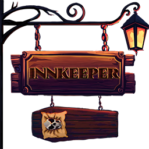

# KindredInnkeeper for V Rising

KindredInnkeeper creates an inn for V Rising, allowing new players to join and get started quickly even with no plots being available.

Feel free to reach out to me on Discord (odjit) if you have any questions or need help with the mod.

## Details

### Setting Up the Inn
To begin, set a clan as the inn by using the `.inn create` command to assign your current clan. Any clan leader can build normally within the inn. If you have Kindred Logistics installed, it is recommended to designate a spare account as the plot owner to keep all settings off for that plot.

### Building the Inn
1. **Foundation**: Place a heart and build the inn to your specifications. It is advisable to include rooms with a coffin and at least one chest for storage.
  
2. **Research Tables**: Utilize Kindred Schematics to create a neutral research table. Remember to move the research table via the build menu after spawning it to ensure it connects to the room properly. This is so that players do not share research unlocks without interacting with the particular table.

### Territory Management
To protect the inn properly, consider using Kindred Schematics to:
- Lock or move-lock the territory once completed. (So players cannot move or dismantle the inn)
- Block the relocation of the castle heart.

### Room Management
Once your layout is complete, use the `.inn addroom` command to add rooms to the inn. After a room is added, players can claim it using the `.inn claimroom` command. Players may leave their room at any time using the `.inn leaveroom` command.

### Gameplay Rules
- While on the territory, players are immune to sunlight.
- Players cannot build or change decorations on the plot while in the clan.
- Players cannot loot chests in another's claimed room.
- Players can only claim one room at a time.
- Players cannot join the inn via the join command if they are in a clan or already have a plot.
- Players cannot open the door to another's claimed room from the hall.
- Players can leave a room even if it is not theirs.
- If a player attempts to place a castle heart, they will receive a warning that this action will remove them from the inn. Upon placing the heart, they will be removed, and any items stored in chests will be transferred to their new plot in travel bags.

### Known Quirks
- As base game allows any clan member to invite, someone who owns a plot could be invited to the clan by a member. This does not break the inn, but would cause issues for the invited on their plot. They can leave the clan to fix.
- If you leave a room as the Plot Owner, you will spawn travel bags with any remaining items at the castle heart.
- Do not have an inn room touching (minesweeper rules) where the castle heart is. The heart is a little bigger than its square, and it messes with the rooms.

## Command List

### Staff Commands
- `.inn create`
  - Makes your current clan the Inn if one doesn't exist.
- `.inn remove`
  - Removes the currently set Inn clan.
- `.inn addroom`
  - Adds a room to the inn.
- `.inn removeroom`
  - Removes a room from the inn.
- `.inn guests`
  - Lists the current guests in the inn.
- `.inn setroomowner (player)`
  - Sets the owner of the room to the specified player.
- `.inn roomowner`
  - Names the owner of the room you are in.
- `.inn inforeload`
  - Reloads the inn info from the config file.

### Player Accessible Commands:
- `.inn join`
  - Adds the user to the inn clan.
- `.inn info`
  - Lists the rules of the inn.
- `.inn quests`
  - Completes quests relating to a castle heart.
- `.inn vacancy`
  - Lists the current vacancies in the inn.
- `.inn claimroom`
  - Claims a room in the inn.
- `.inn leaveroom`
  - Removes the user from the room

 

[V Rising Modding Discord](https://vrisingmods.com/discord)                     |          [V Rising Modding Wiki](https://wiki.vrisingmods.com)

## Installation

 
Steps

1. Install BepInEx, which is required for modding VRising. Follow the instructions provided at [BepInEx Installation Guide](https://wiki.vrisingmods.com/user/bepinex_install.html) to set it up correctly in your VRising game directory.

2. Download the KindredInnkeeper mod along with its dependencies (VCF). Ensure you select the correct versions that are compatible with your game.

3. After downloading, locate the .dll files for KindredInnkeeper and its dependencies. Move or copy these .dll files into the `BepInEx\Plugins` directory within your VRising installation folder.

   - **Single Player Note:**
     - If you are playing in single player mode, you will need to install [ServerLaunchFix](https://thunderstore.io/c/v-rising/p/Mythic/ServerLaunchFix/). This is a server-side mod that is essential for making the commands work properly on the client side. Make sure to download and place it in the same `BepInEx\Plugins` directory.

4. Launch the Game: Start VRising. If everything has been set up correctly, KindredInnkeeper should now be active in the game.

Additional Notes

- **Using Commands:** The commands for KindredInnkeeper go into the chat box, not the console. However, players will first need to authenticate themselves in the console chat. You can find instructions on how to do this [here](https://wiki.vrisingmods.com/user/Using_Server_Mods.html).
- For thorough mod installation instructions and troubleshooting, visit [VRising Mod Installation Guide](https://wiki.vrisingmods.com/user/Mod_Install.html).
- If you encounter any issues, refer to the V Rising Modding Community discord for tech support. 

## Credits

- [V Rising Modding Community](https://vrisingmods.com) for support and ideas.

## License

This project is licensed under the AGPL-3.0 license.